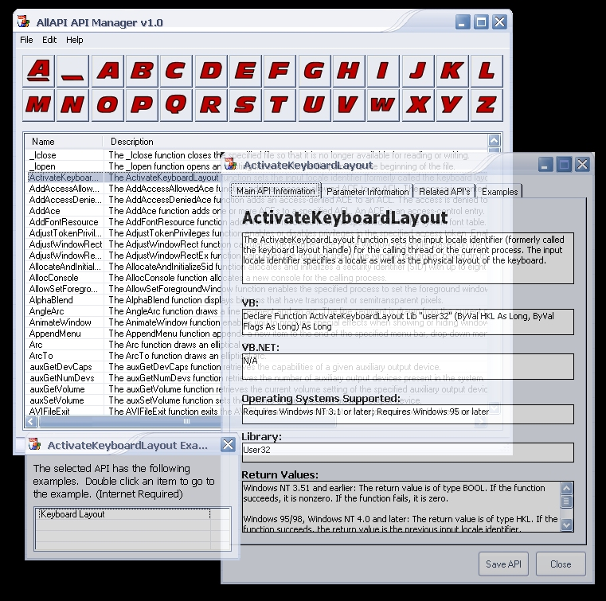



## AllAPI API Manager/Viewer

### Description

AllAPI parses the wonderful site www.allapi.net collecting every API call from it, storing every detail about each API and lists it allowing you to view details, save, copy and paste code, print (eventually), and more. It also links you to examples of the API (must be connected to internet). This is perfect for any programmer! Never navigate your way through API websites again. Click the "Update" menu item to parse the website and update your API calls. MUST SEE!! Some code was not written by myself, just snippets of code I have collected over the years and for this I am sorry I cannot give the proper credit to their original authors. Please Vote! Thank you.
 
### More Info
 

             |
---                |---
**Submitted On**   |2004-08-30 12:46:08
**By**             |[Mike Davis](https://github.com/Planet-Source-Code/PSCIndex/blob/master/ByAuthor/mike-davis.md)
**Level**          |Advanced
**User Rating**    |5.0 (90 globes from 18 users)
**Compatibility**  |VB 6\.0
**Category**       |[Complete Applications](https://github.com/Planet-Source-Code/PSCIndex/blob/master/ByCategory/complete-applications__1-27.md)
**World**          |[Visual Basic](https://github.com/Planet-Source-Code/PSCIndex/blob/master/ByWorld/visual-basic.md)
**Archive File**   |[AllAPI\_API179141992004\.zip](https://github.com/Planet-Source-Code/mike-davis-allapi-api-manager-viewer__1-56088/archive/master.zip)

